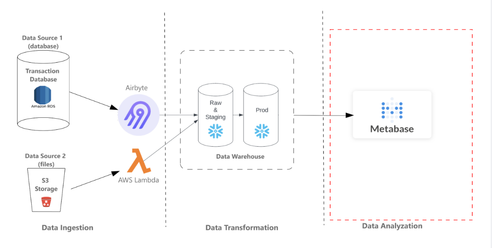
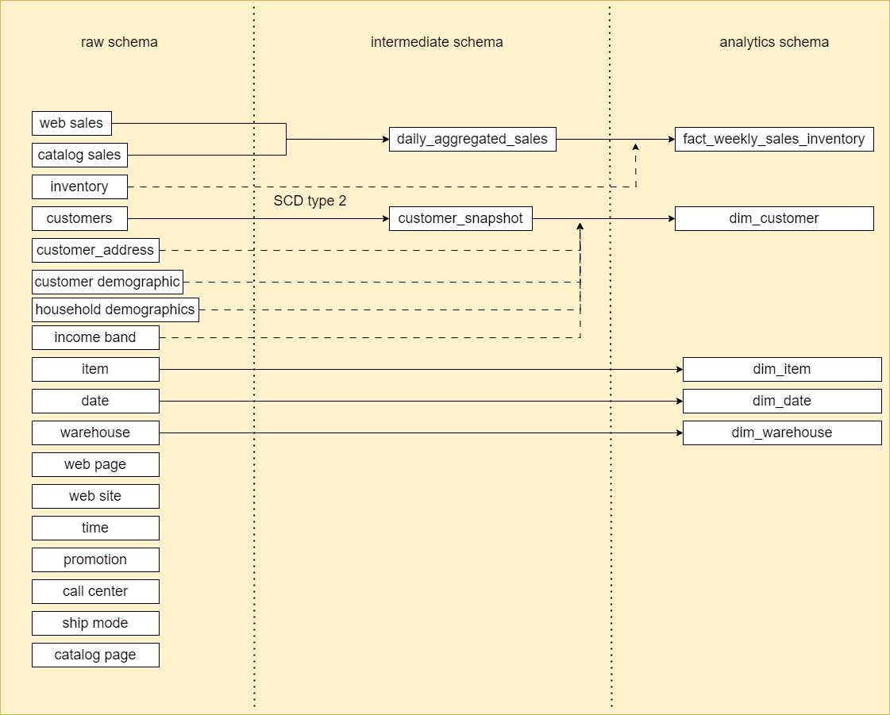

# Analytical Data Engineering Project: Leveraging Snowflake

## Overview
This project involves Analytical Data Engineering, focusing on the ingestion of data from various sources and its loading into the Snowflake data warehouse. The data undergoes transformation processes within the warehouse to prepare it for Business Intelligence (BI) usage. Metabase connects to the data warehouse to generate diverse dashboards and reports.

## Architecture



<p></p>
<p></p>

## Dashboard


## About Data

### Data Background
The dataset utilized originates from TPCDS, designed for database testing, emphasizing Retail Sales. It includes sales records from websites and catalogs, along with inventory levels for each item within every warehouse. Additionally, it contains 15 dimensional tables with valuable information about customers, warehouses, items, etc.

### Data Sources
- **RDS:** Most tables, except for the inventory, are stored in a Postgres DB on AWS RDS. These tables refresh daily with the latest sales data.
- **S3 Bucket:** The inventory table is stored in an S3 bucket, with a new file containing the most recent data deposited daily.

### Tables in the Dataset
Refer to the [schema](schema.xlsx) for table details.

## Business Requirements

### Metabase Requirements
- Determine top and bottom-performing items of the week based on sales amounts and quantities.
- Display items with low inventory levels weekly.
- Identify items with low stock levels, including associated week and warehouse numbers.

### Snowflake Data Warehouse Requirements
New tables need to be created to meet BI requirements:
- Consolidate certain raw tables.
- Create a new weekly fact table incorporating additional metrics.

## Project Infrastructure
The infrastructure is cloud-based:
- **Servers:** Created on AWS.
- **Tools:** Installed include Airbyte for data ingestion and Metabase for BI.
- **Cloud Data Warehouse:** Snowflake is used for data storage and transformation.
- **AWS Lambda:** Utilized for data ingestion from S3.

## Project Workflow

### Part One: Data Ingestion
- Connect to Postgres DB on RDS using Airbyte.
- Transfer all tables to Snowflake.
- Ingest inventory.csv file from S3 to Snowflake using AWS Lambda.

### Part Two: Data Transformation
- Reshape tables within Snowflake.
- Develop ETL scripts.
- Establish a schedule for data loading.

### Part Three: Data Analysis
- Establish a connection between Snowflake and Metabase.
- Create dashboards and reports in Metabase using Snowflake data.

## Data Modeling
- Create schemas and tables in Snowflake for the data model. 
 [ddl_script](Snowflake/DDL.sql)
- Develop ETL scripts for populating tables.



## ETL Scripts
- Develop a merge script to integrate the new Customer dimension table into the existing dimension table within the Analytics schema, following SCD Type 2 methodology.
- Develop a merge script to incorporate the newly added daily sales records into the existing daily sales fact table within the Analytics schema.
- Create a script to perform a join between the daily sales fact table and the updated inventory table, creating the weekly sales and inventory fact table within the Analytics schema.

## Scheduling with Snowflake
- Set up automated processes for daily and weekly data aggregations.
- Schedule tasks using Snowflake Tasks and stored procedures.

```sql
-- Creating a scheduled task
CREATE OR REPLACE TASK TPCDS.ANALYTICS.creating_monthly_customer_program_incrementally
    WAREHOUSE = COMPUTE_WH
    SCHEDULE = 'USING CRON 0 0 21 * * UTC'
    AS
CALL populating_monthly_customer_program_incrementally();
```


## Data Visualization
- Use Metabase to visualize data and generate reports.
- Address business requirements for Metabase reports.

## Metabase Installation
Ensure proper EC2 configuration before starting Metabase installation.

## Folder Structure
- **Lambda:** Contains python script for ingesting data from s3.
- **Snowflake:** Includes ETL scripts, EDA and data model definitions.

## Getting Started
1. Set up servers on AWS.
2. Install necessary tools (Airbyte, Metabase).
3. Create a Snowflake account and set up data storage.
4. Configure AWS Lambda for S3 ingestion.
5. Execute ETL scripts and schedule tasks for automation.
6. Install and configure Metabase on EC2 instance.

## Notes
- Ensure proper security configurations for AWS services.
- Regularly update ETL scripts and configurations as needed.
- Monitor infrastructure and data processing tasks for optimal performance.
